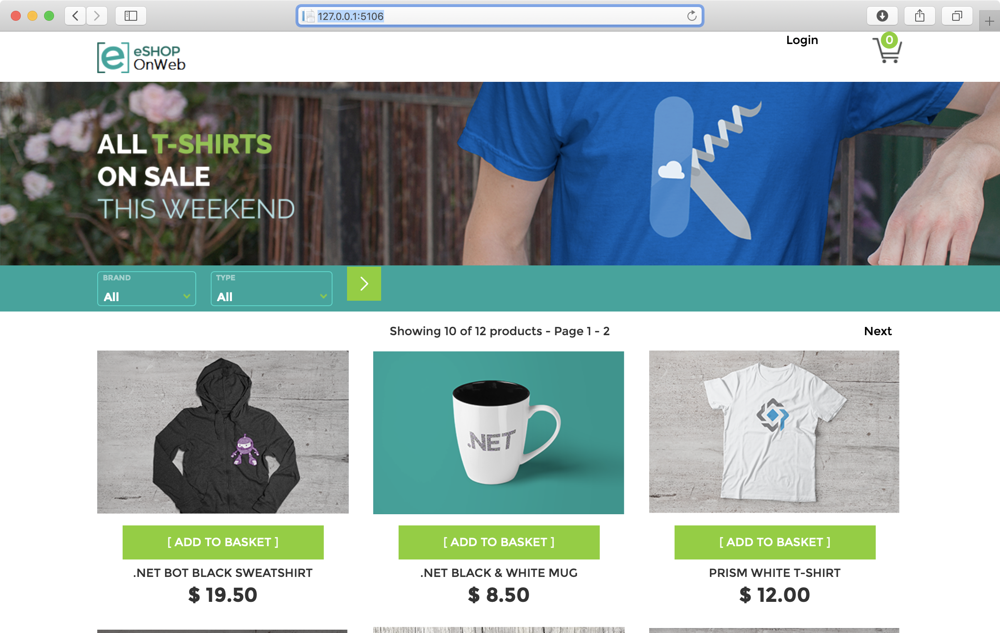

# eShopOnWeb
源自：https://github.com/dotnet-architecture/eShopOnWeb

这是一个微软官方的示例项目，基于ASP.NET Core构建。数据库使用了mssqlserver for linux。
eShopOnWeb基于传统Web应用开发，单体部署（微服务部署方式在另外的eShopOnContainers中介绍）。
 

eShopOnWeb的示例项目中包含两个Web项目，一个是基于MVC创建的MPA多页面应用，一个是基于Razor创建的SPA单页面应用。本例中采用的MVC的Web项目，端口为5106。如果使用Razor项目修改Dockerfile中的:

WORKDIR /app/src/Web     <b>为</b>   WORKDIR /app/src/WebRazorPages  

EXPOSE 5106    <b>为</b>    EXPOSE 5107

ENTRYPOINT ["dotnet", "Web.dll"]        <b>为</b>       ENTRYPOINT ["dotnet", "Web.dll"]

eShopOnWeb中应用了DDD和整洁架构的部分思想,详情请参照文章 [《eShopOnWeb知多少》](https://www.jianshu.com/p/ca6b64b81217)。

